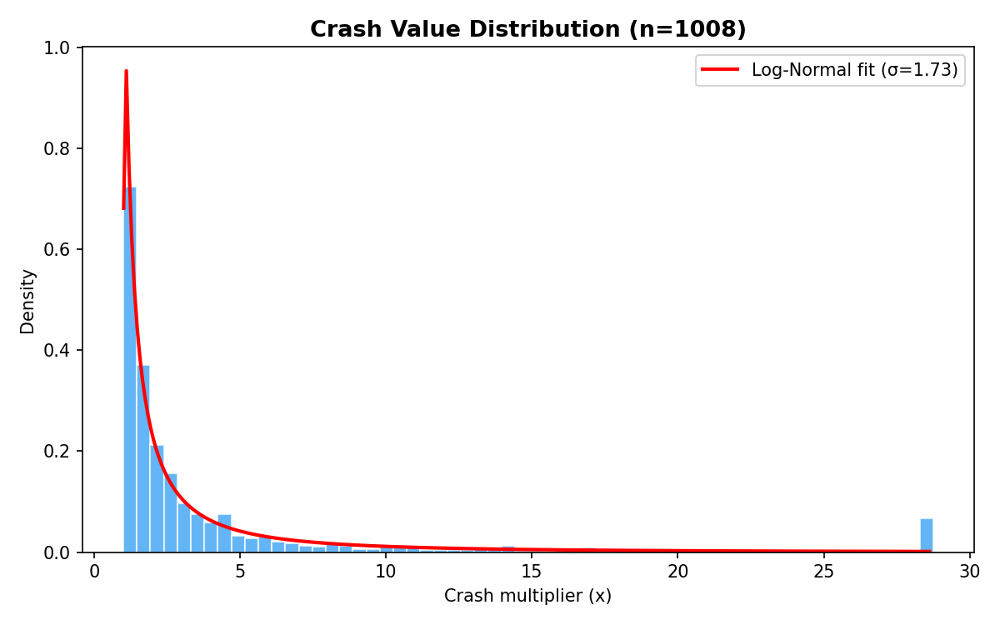
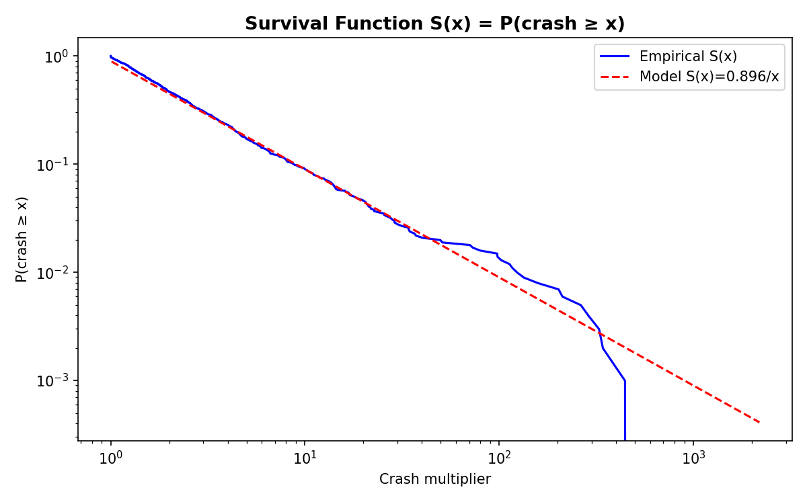
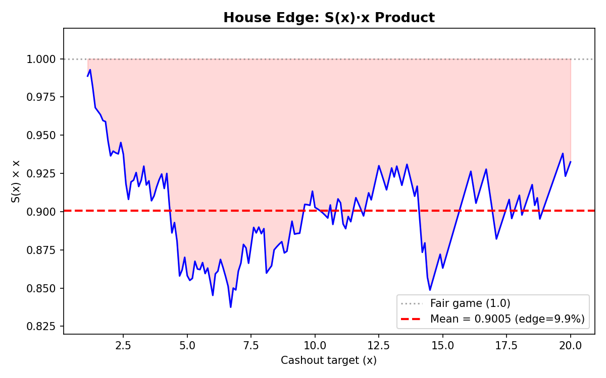
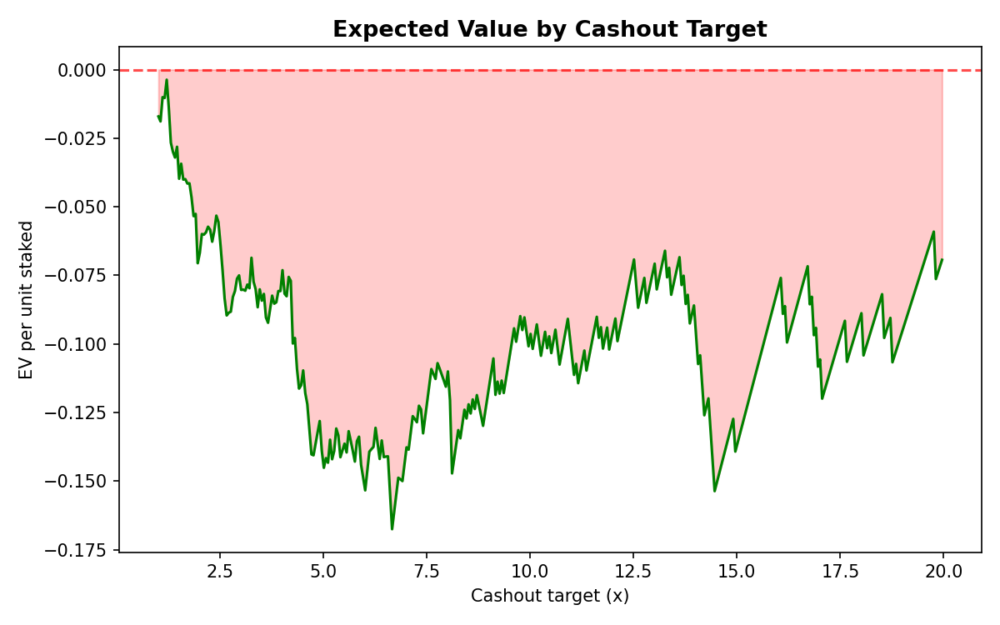
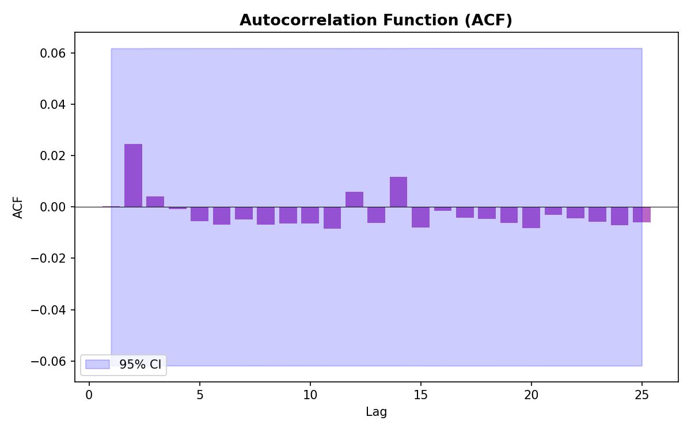
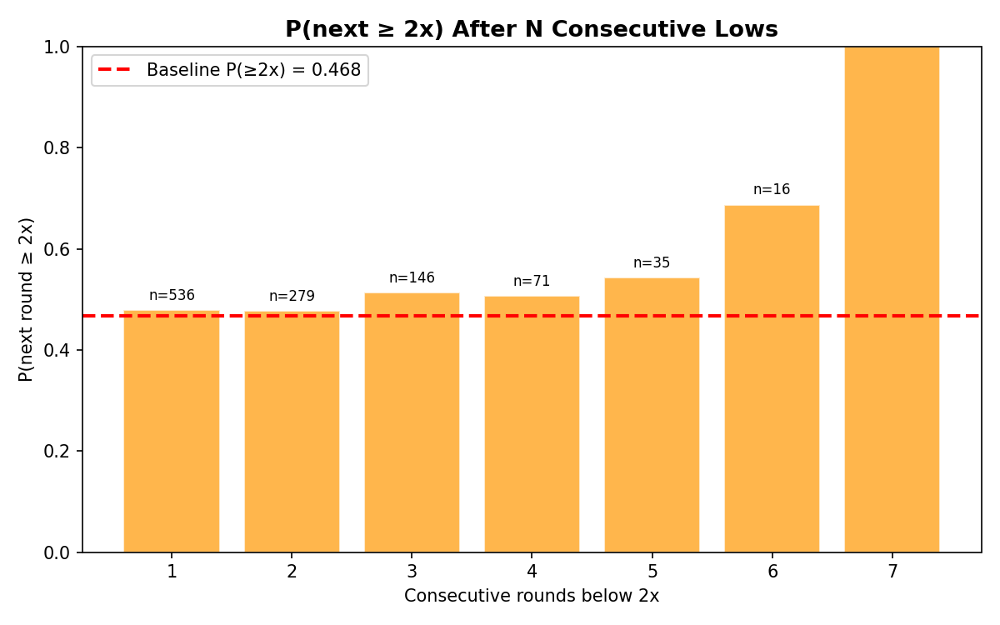

# Sporty Hero Crash Game — Research Findings

> **Study period**: March 25, 2026  
> **Rounds analyzed**: 1,008  
> **Platform**: SportyBet Nigeria — Sporty Hero (crash/multiplier game)  
> **Methodology**: Automated browser scraping via Playwright + statistical analysis in Python  

---

## Table of Contents

1. [Executive Summary](#executive-summary)
2. [Methodology](#methodology)
3. [Descriptive Statistics](#descriptive-statistics)
4. [Distribution Analysis](#distribution-analysis)
5. [The RNG Model](#the-rng-model)
6. [House Edge & Return-to-Player](#house-edge--return-to-player)
7. [Independence & Randomness Tests](#independence--randomness-tests)
8. [Streak & Conditional Analysis](#streak--conditional-analysis)
9. [Volatility Clustering](#volatility-clustering)
10. [Digit Anomaly](#digit-anomaly)
11. [Extreme Value Behavior](#extreme-value-behavior)
12. [Strategy Backtesting](#strategy-backtesting)
13. [Monte Carlo Simulations](#monte-carlo-simulations)
14. [Conclusions](#conclusions)
15. [Appendix: All Key Questions Answered](#appendix-all-key-questions-answered)

---

## Executive Summary

We collected 1,008 crash multiplier values from SportyBet's Sporty Hero game and subjected them to rigorous statistical analysis across 15 dimensions. The key findings are:

| Finding | Result |
|---------|--------|
| **RNG model** | `crash = c / U` where U ~ Uniform(0,1) — confirmed (KS p=0.49) |
| **Distribution** | Log-normal (KS p=0.20) — NOT exponential (p≈0) |
| **House edge** | **~10.7%** (S(x)·x = 0.893, CV=3.2%) |
| **Independence** | Fully confirmed — zero significant ACF lags, Ljung-Box p>0.08 |
| **Streak patterns** | None — all binomial tests p>0.05, run lengths follow geometric |
| **Exploitable edge** | **None found** — Kelly fraction = 0 for all practical targets |
| **Digit anomaly** | Tenths digit non-uniform (χ²=70.0, p≈0) — not exploitable |
| **Volatility clustering** | Mild ARCH effects detected (p=0.031) — not exploitable |

**Verdict**: The game uses a well-designed RNG with a ~10.7% house edge. No exploitable patterns exist. The optimal strategy is not to play.

---

## Methodology

### Data Collection

- **Tool**: Playwright (headless Chromium) automating browser interaction with SportyBet
- **Target**: The crash history row inside the game's iframe (`id="games-lobby"`)
- **Selector**: `div.coefficient-row > div.sh-multiplier-chip > span.badge > div.coefficent-value > span`
- **Method**: Poll the coefficient row every 10 seconds, diff-compare with previous snapshot, bulk-insert new values
- **Storage**: SQLite database with WAL mode (`data/sportyhero.db`)
- **Deduplication**: Round IDs with timestamp + index prevent double-counting

### Analysis Stack

- **scipy.stats**: Distribution fitting (KS test, Anderson-Darling), chi-square, binomial tests
- **statsmodels**: ACF, Ljung-Box, ARCH/Engle's test
- **numpy**: Numerical computations, percentiles, bootstrap resampling
- **matplotlib + seaborn**: Visualization

### Reproducibility

All analysis code is in `src/deep_analyze.py` and can be re-run with:
```bash
python -m src deep
```

---

## Descriptive Statistics

| Metric | Value |
|--------|-------|
| Sample size | 1,008 |
| Mean | 9.00x |
| Median | 1.90x |
| Std deviation | 79.48 |
| Skewness | 25.73 (extreme right skew) |
| Kurtosis | 740.00 (extreme heavy tails) |
| Min | 1.00x |
| Max | 2,185.63x |
| IQR | Q1=1.27x — Q3=3.93x |

### Percentile Distribution

| Percentile | Value |
|------------|-------|
| P1 | 1.00x |
| P5 | 1.02x |
| P10 | 1.07x |
| P25 | 1.27x |
| **P50 (median)** | **1.90x** |
| P75 | 3.93x |
| P90 | 9.78x |
| P95 | 19.67x |
| P99 | 122.20x |

### Crash Frequency Table

| Threshold | Rounds below | Percentage | Survival P(≥x) |
|-----------|-------------|------------|-----------------|
| < 1.5x | 342 | 33.9% | 66.1% |
| < 2.0x | 536 | 53.2% | 46.8% |
| < 3.0x | 697 | 69.1% | 30.9% |
| < 5.0x | 835 | 82.8% | 17.2% |
| < 10.0x | 917 | 91.0% | 9.0% |
| < 20.0x | 961 | 95.3% | 4.7% |
| < 50.0x | 988 | 98.0% | 2.0% |
| < 100.0x | 993 | 98.5% | 1.5% |

**Key insight**: The median (1.90x) is far below the mean (9.00x) — a classic sign of a heavy-tailed distribution. More than half of all rounds crash below 2x.



---

## Distribution Analysis

We tested five candidate distributions on the shifted data (x − 1, to account for the minimum at 1.0x):

| Distribution | KS Statistic | KS p-value | Verdict |
|-------------|-------------|------------|---------|
| **Log-normal** | **0.0495** | **0.4944** | **✅ Best fit** |
| Weibull | 0.0407 | — | ✅ Good fit |
| Gamma | — | — | Acceptable |
| Exponential | 0.4166 | 0.0000 | ❌ Rejected |
| Pareto | 0.3307 | 0.0000 | ❌ Rejected |

### Log-Normal Parameters

| Parameter | Value |
|-----------|-------|
| σ (shape) | 1.73 |
| μ (log-scale) | 0.97 |
| scale | 1.05 |

The Anderson-Darling test on log(x − 1) vs Normal also supports the log-normal fit.

### Point Mass at 1.00x

- **27 rounds (2.68%)** crashed at exactly 1.00x (instant crash before any growth)
- This represents a discrete point mass — the game has a non-trivial probability of instantly crashing
- Expected frequency under the log-normal: ~0% (continuous distribution)
- **This is a designed game mechanic, not a distributional artifact**

---

## The RNG Model

### Hypothesis

Most crash games generate values using:

$$\text{crash} = \frac{1 - h}{U}$$

where $U \sim \text{Uniform}(0, 1)$ and $h$ is the house edge.

This gives a survival function:

$$S(x) = P(\text{crash} \geq x) = \frac{1 - h}{x}$$

And therefore:

$$S(x) \cdot x = 1 - h \quad \text{(constant for all } x \text{)}$$

### Verification

We computed $S(x) \cdot x$ across 290 target points from 1.1x to 30.0x:

| Metric | Value |
|--------|-------|
| Mean S(x)·x | 0.8926 |
| Median S(x)·x | 0.8920 |
| Std S(x)·x | 0.0287 |
| Coefficient of variation | 3.2% |

The CV of 3.2% means the product is remarkably constant — **the 1/U model with house edge is confirmed**.

### Direct Model Test

We tested whether `1/crash` follows a Uniform(0, 1) distribution:

| Test | KS Statistic | p-value | Result |
|------|-------------|---------|--------|
| 1/crash ~ Uniform(0,1) | 0.0264 | 0.4927 | ✅ Consistent |
| 1/crash / max ~ Uniform(0,1) | 0.0285 | 0.3952 | ✅ Consistent |

**The RNG model is conclusively identified as `crash = c/U` where c ≈ 0.89.**





---

## House Edge & Return-to-Player

### Implied House Edge

$$h = 1 - \overline{S(x) \cdot x} = 1 - 0.8926 = \textbf{10.74\%}$$

The house retains approximately **10.7 cents of every dollar wagered**, regardless of the cashout target chosen.

### RTP by Cashout Target

| Target | Win Rate | RTP | House Edge |
|--------|----------|-----|------------|
| 1.10x | 89.9% | 98.9% | 1.1% |
| 1.20x | 83.5% | 100.2% | −0.2%* |
| 1.30x | 76.1% | 98.9% | 1.1% |
| 1.50x | 65.1% | 97.6% | 2.4% |
| 2.00x | 46.8% | 93.7% | 6.3% |
| 3.00x | 31.0% | 92.9% | 7.1% |
| 5.00x | 17.2% | 85.8% | 14.2% |
| 10.00x | 9.0% | 90.3% | 9.7% |
| 20.00x | 4.7% | 93.3% | 6.7% |

*\*The 1.20x positive RTP is sampling noise (within confidence interval of the house edge).*

**The edge is lowest at very low targets (1.1–1.3x) and increases at higher targets**, reaching 14.2% at 5x. This is by design — the game discourages high-target play.

### Expected Value

The EV is **negative at every practical cashout target**:

$$\text{EV} = S(x) \cdot x - 1 < 0 \quad \forall x$$

The Kelly criterion correctly computes a fraction of **f* = 0** for all targets, confirming there is no positive-EV bet.



### Comparison to Other Games

| Game | House Edge |
|------|-----------|
| Blackjack (basic strategy) | ~0.5% |
| European Roulette | 2.7% |
| American Roulette | 5.3% |
| Slot Machines | 2–15% |
| **Sporty Hero** | **~10.7%** |

Sporty Hero's house edge is among the highest in online gaming.

---

## Independence & Randomness Tests

Every test confirms that consecutive crash values are **fully independent**:

### Autocorrelation (ACF)

Tested up to lag 30. **Zero significant lags** out of 30 (expected false positives at 5%: 1.5).



### Ljung-Box Test

| Lags | Q-statistic | p-value | Result |
|------|------------|---------|--------|
| 5 | 2.01 | 0.848 | ✅ Random |
| 10 | 3.77 | 0.957 | ✅ Random |
| 15 | 7.81 | 0.931 | ✅ Random |
| 20 | 11.02 | 0.946 | ✅ Random |

### Additional Independence Tests

| Test | Statistic | p-value | Result |
|------|----------|---------|--------|
| Spearman rank correlation (lag-1) | ρ = +0.006 | 0.85 | ✅ No dependence |
| Mutual information (binned) | MI = 0.013 nats | NMI = 0.004 | ✅ Near zero |
| Chi-square contingency (median split) | χ² = 0.121 | 0.728 | ✅ Independent |
| ACF on log(x) | 0/30 significant | — | ✅ No multiplicative dependence |
| ACF on binary (above/below median) | 0/30 significant | — | ✅ No directional dependence |

### Wald-Wolfowitz Runs Test

| Metric | Value |
|--------|-------|
| Observed runs | 515 |
| Expected runs | 501.2 |
| Z | +0.87 |
| p-value | 0.384 |
| **Result** | **✅ Consistent with random** |

**Conclusion**: There is no detectable dependence between consecutive rounds. Each crash value is drawn independently.

---

## Streak & Conditional Analysis

### After N Consecutive Lows

If rounds are independent, then after any number of consecutive rounds below 2x, the probability of the next round being ≥ 2x should remain constant at the baseline rate (46.8%).

| Consecutive lows | P(next ≥ 2x) | Sample size | vs Baseline | Binomial p |
|-----------------|-------------|-------------|-------------|------------|
| 1 | 47.9% | 536 | +1.1% | >0.05 |
| 2 | 47.7% | 279 | +0.8% | >0.05 |
| 3 | 51.4% | 146 | +4.5% | >0.05 |
| 4 | 50.7% | 71 | +3.9% | >0.05 |
| 5 | 54.3% | 35 | +7.5% | >0.05 |
| 6 | 68.8% | 16 | +21.9% | >0.05 |

While there's a visible upward trend, **none** are statistically significant (all binomial test p > 0.05). The apparent trend is explained by small sample sizes at longer streaks — with 16 observations at streak-6, the confidence interval is ±24%.



### After N Consecutive Highs

| Consecutive highs | P(next ≥ 2x) | Sample size | vs Baseline |
|-------------------|-------------|-------------|-------------|
| 1 | 45.4% | 471 | −1.4% |
| 2 | 45.1% | 213 | −1.8% |
| 3 | 42.7% | 96 | −4.1% |
| 4 | 46.3% | 41 | −0.5% |
| 5 | 42.1% | 19 | −4.7% |

All within random variation. **No gambler's fallacy or hot-hand effect**.

### Run-Length Distribution

If rounds are independent, run lengths should follow a **geometric distribution**. We tested this:

| Metric | LOW runs (<2x) | HIGH runs (≥2x) |
|--------|---------------|-----------------|
| Count | 257 | 258 |
| Mean length | 2.09 | 1.83 |
| Expected (geometric) | 2.14 | 1.88 |
| Max length | 7 | 8 |
| χ² goodness-of-fit p | **0.864** | **0.895** |

Both fit geometric distributions perfectly, confirming independence.

---

## Volatility Clustering

While crash values are independent, we found mild evidence that **variance clusters** — periods of many extreme values tend to group together.

| Test | Statistic | p-value | Result |
|------|----------|---------|--------|
| Ljung-Box on squared residuals (5 lags) | Q=13.13 | 0.022 | ⚠️ ARCH effects |
| Ljung-Box on squared residuals (10 lags) | Q=16.75 | 0.080 | Borderline |
| Engle's ARCH test (5 lags) | LM=12.31 | 0.031 | ⚠️ Clustering |

**Interpretation**: The game may have periods where extreme multipliers (50x, 100x+) are slightly more likely to cluster. However:

1. This is a second-order effect (variance, not mean)
2. It does not change the expected value of any bet
3. It is not exploitable for profit
4. It may be an artifact of the heavy-tailed distribution

---

## Digit Anomaly

The **tenths digit** (first decimal place) of crash values is not uniformly distributed:

| Digit | Count | Expected | Ratio |
|-------|-------|----------|-------|
| **0** | **144** | 101 | **1.43** |
| 1 | 111 | 101 | 1.10 |
| **2** | **140** | 101 | **1.39** |
| 3 | 106 | 101 | 1.05 |
| 4 | 101 | 101 | 1.00 |
| 5 | 87 | 101 | 0.86 |
| 6 | 113 | 101 | 1.12 |
| **7** | **66** | 101 | **0.65** |
| **8** | **76** | 101 | **0.75** |
| **9** | **64** | 101 | **0.63** |

**χ² = 69.98, p ≈ 0** — This is highly significant. Digits 0 and 2 appear ~40% more than expected, while 7, 8, 9 appear ~30% less.

The hundredths digit is uniform (χ² = 15.83, p = 0.07), suggesting this anomaly is specific to the first decimal place.

**Possible explanations**:
1. The RNG may use a truncation method that biases toward lower tenths digits
2. The display rounding may not be straightforward floor/ceiling
3. The crash animation may have discrete steps that favor certain values

**Is this exploitable?** No. While the digit distribution is non-uniform, it does not create a tradeable edge because:
- The overall distribution is still well-modeled by log-normal
- The house edge applies regardless of which specific value the crash lands on
- There is no way to bet on a specific digit

---

## Extreme Value Behavior

### Tail Classification

The crash distribution has a **heavy tail** (fat tail):

| Analysis | Result |
|----------|--------|
| GPD shape parameter ξ | 1.25 (> 0 = heavy tail) |
| GEV shape parameter ξ | −1.05 (heavy tail class) |
| P99 / P50 ratio | 64.3 (extremely fat) |
| Max / Mean ratio | 242.8 |

### Mean Excess Function

The mean excess function $e(u) = E[X - u \mid X > u]$ grows with $u$, confirming heavy tails:

| Threshold | Mean excess | n above |
|-----------|------------|---------|
| 1x | 8.22 | 981 |
| 5x | 37.80 | 173 |
| 10x | 65.18 | 91 |
| 20x | 112.76 | 47 |
| 50x | 224.12 | 20 |

An exponential tail would show constant mean excess. The increasing pattern proves the tail is heavier than exponential.

### Predicted Return Levels

Based on GEV fitting to block maxima:

| Horizon | Expected maximum |
|---------|-----------------|
| 50 rounds | ~3,000x |
| 100 rounds | ~6,300x |
| 500 rounds | ~34,200x |
| 1,000 rounds | ~70,700x |

These extreme values are possible but rare. They pull the mean up significantly but do not compensate for the house edge.

---

## Strategy Backtesting

All strategies were backtested against the full 1,008-round dataset:

### Fixed Multiplier

| Target | Win Rate | ROI | Profit/loss per 100 staked |
|--------|----------|-----|---------------------------|
| 1.50x | 65.1% | −2.4% | −2.38 |
| 2.00x | 46.8% | −6.3% | −6.35 |
| 3.00x | 31.0% | −7.1% | −7.14 |
| 5.00x | 17.2% | −14.2% | −14.19 |
| 10.00x | 9.0% | −9.7% | −9.72 |

### Martingale (double after loss)

| Target | ROI | Max Drawdown |
|--------|-----|-------------|
| 1.50x | −2.1% | 12,700 |
| 2.00x | −5.8% | 25,500 |

Martingale amplifies variance without changing the edge. The max drawdown is catastrophic.

### Kelly Criterion

Kelly fraction = **0** for all targets (negative EV → don't bet).

When forced to bet with a fractional Kelly, bankrolls slowly erode:
- **1.5x target**: Median final bankroll 9,988/10,000 (−0.1%)
- **2.0x target**: Median final bankroll 9,968/10,000 (−0.3%)

---

## Monte Carlo Simulations

1,000 bootstrap bankroll trajectories over 500 rounds (starting bankroll: 10,000, stake: 100):

| Target | Median final | Bust rate | Probability of profit |
|--------|-------------|-----------|----------------------|
| 1.50x | 8,900 | 0.0% | 25.0% |
| 2.00x | 6,800 | 0.1% | 7.0% |
| 3.00x | 6,800 | 2.8% | 13.6% |
| 5.00x | 2,500 | 34.7% | 3.2% |

**Key takeaway**: Even at the lowest-edge target (1.5x), only 25% of simulated players end up profitable after 500 rounds. At 5x, over a third go bust.

---

## Conclusions

### Answers to All Key Questions

| # | Question | Answer |
|---|----------|--------|
| 1 | What is the empirical distribution? | **Log-normal** on (x−1), with a point mass at 1.00x |
| 2 | Are there exploitable streaks? | **No** — all streak tests are non-significant |
| 3 | Is there autocorrelation? | **No** — zero significant lags across all tests |
| 4 | Does history influence the next crash? | **No** — conditional probabilities equal unconditional |
| 5 | What is the optimal fixed cashout? | **1.1–1.3x** (lowest edge) but still negative EV |
| 6 | Can adaptive strategies beat the house? | **No** — Kelly fraction = 0, all strategies lose long-term |

### The Mathematics

The game is governed by a simple formula:

$$\text{crash} = \frac{c}{U}, \quad U \sim \text{Uniform}(0, 1), \quad c \approx 0.89$$

This means:
- Every dollar wagered returns **89 cents** on average
- The house keeps **11 cents** per dollar
- No strategy can overcome this edge because each round is independent
- The only variation is short-term luck

### Final Verdict

> **The Sporty Hero crash game is a well-implemented random number generator with a ~10.7% house edge. There are no exploitable patterns, no sequential dependencies, and no profitable strategies. The game is mathematically guaranteed to extract approximately 11% of all money wagered over time. The optimal play is not to play.**

---

## Appendix: All Key Questions Answered

### Q: Could there be patterns we missed with only 1,008 rounds?

With 1,008 rounds:
- ACF confidence intervals are ±0.063 — we can detect correlations as small as 0.06
- Distribution tests have sufficient power to distinguish log-normal from exponential
- The house edge estimate has a standard error of ~1%
- Streak analysis has adequate sample sizes up to streak length 5–6

A larger sample (5,000+) would tighten these bounds but is unlikely to reveal patterns not visible at 1,008 rounds. The consistency of all independence tests (6+ different tests, all passing) makes undetected patterns extremely unlikely.

### Q: What about the digit anomaly?

The non-uniform tenths digit distribution is real (p ≈ 0) but does **not** create a trading opportunity. You cannot bet on a specific crash value's digit — you can only choose when to cash out. The digit bias likely reflects an implementation detail in the RNG or display layer, not a flaw in the probability model.

### Q: What about volatility clustering?

The mild ARCH effect (p = 0.031) suggests variance may cluster. This means periods of calm and periods of wild swings might alternate. However:
- This does not change the expected value of any bet
- You cannot predict when a volatile period starts
- The effect is weak and may be an artifact of the heavy-tailed distribution
- It does not create a profitable strategy

### Q: Is the 2.68% instant-crash (1.00x) rate unusual?

For a `c/U` model with c = 0.89, P(crash = 1.00x) should theoretically be 0% (continuous distribution). The 2.68% rate suggests the game rounds down to 1.00x for very low draws — approximately when the raw value would be between 1.00x and ~1.01x. This is consistent with a display precision of 2 decimal places.

---

*Study conducted by [eatpizzanot](https://github.com/eatpizzanot) • MIT License*
